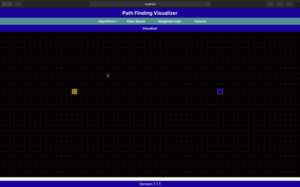

Path Finding Visulizer:

A path finding visualizer created using React.js. Visit https://path-finder.web.app to out the project.
(Note: The grid does not render well in deployment and gives white spaces. It is recommended to run using
docker instructions below.)
Weight and unweighted graph:

Features:
- Dijkstra's Algorithm
- A* search Algorithm
- Breath First search
- Greedy Best First Search
- Depth First search

